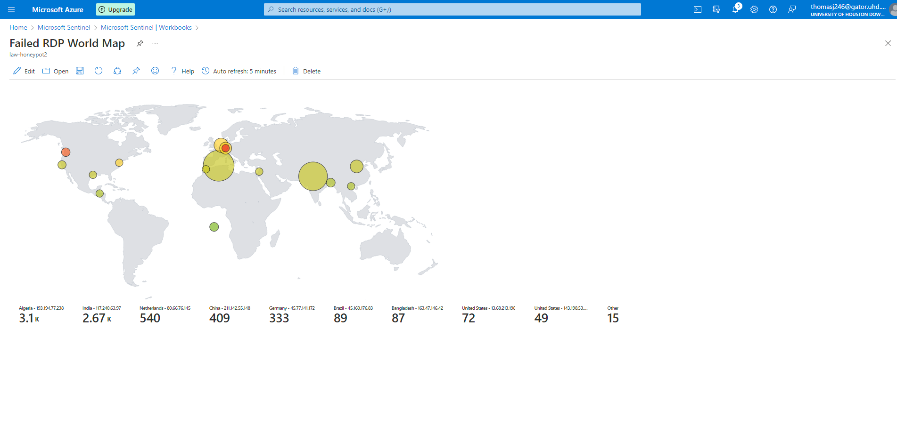
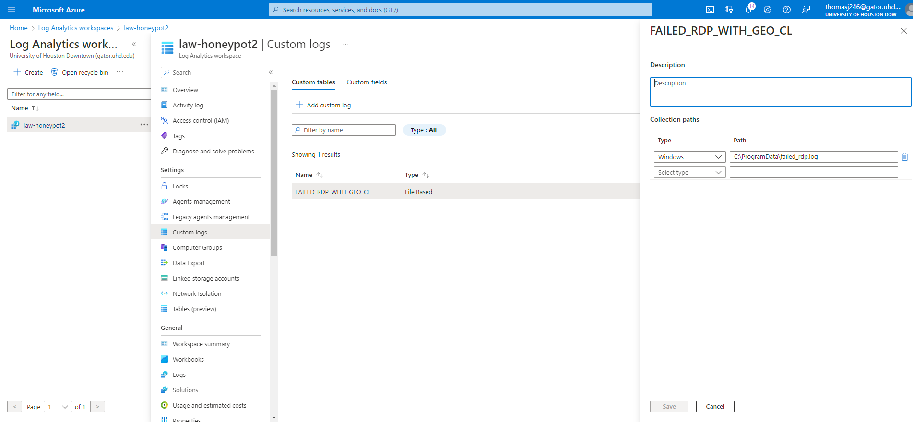
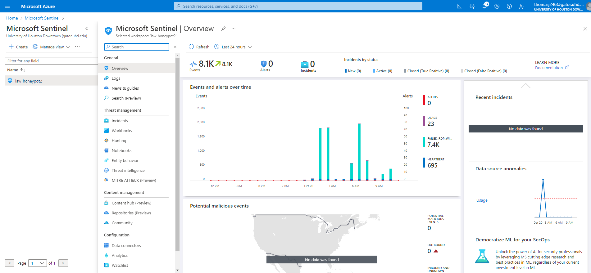

# Honeypot Lab

Following Video: https://www.youtube.com/watch?v=RoZeVbbZ0o0

## Steps:
1. Created a VM in Azure
2. Created Log Analytics in Workspace
3. Enabled gathering VM logs
4. Connected Log Analytics to VM 
5. Setup Azure Sentinel
6. Downloaded [Powershell script](https://github.com/joshmadakor1/Sentinel-Lab/blob/main/Custom_Security_Log_Exporter.ps1)
7. Got Geolocation API Key
8. Started the script to get geo data from attackers
9. Creating a vustom log in LAW to bring in custom log
10. Setup map in sentinel with latitude and longitude

## Screenshots
### RDP Attacks Map

### Custom Log

### Sentinel Setup

